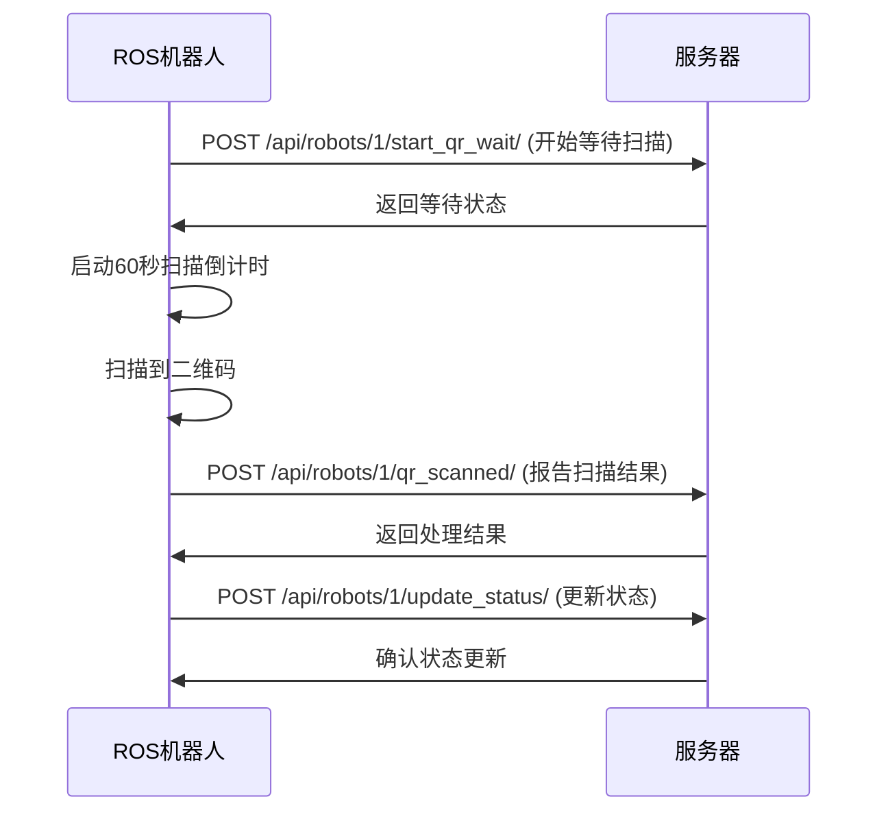
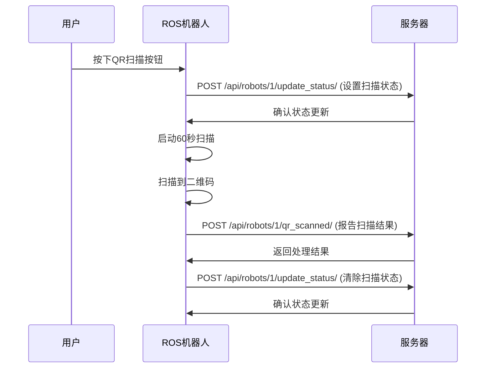

# 📱 QR扫描按钮API接口

## 🎯 接口概述

QR扫描按钮相关的API接口，用于控制机器人的二维码扫描功能。

---

## 🔐 认证

所有API请求都需要在请求头中包含JWT访问令牌：

```http
Authorization: Bearer <access_token>
Content-Type: application/json
```

---

## 📡 API接口列表

### 1. 开始QR扫描

**接口地址**: `POST /api/robots/{robot_id}/start_qr_wait/`

**功能**: 机器人到达目的地后，开始等待用户扫描二维码

**请求参数**:
```json
{
    "order_id": 123
}
```

**响应示例**:
```json
{
    "message": "订单 123 开始等待二维码扫描",
    "qr_wait_start_time": "2024-01-15T10:30:00Z"
}
```

**使用示例**:
```bash
curl -X POST http://localhost:8000/api/robots/1/start_qr_wait/ \
  -H "Authorization: Bearer your_token_here" \
  -H "Content-Type: application/json" \
  -d '{"order_id": 123}'
```

---

### 2. QR扫描处理

**接口地址**: `POST /api/robots/{robot_id}/qr_scanned/`

**功能**: 机器人扫描到二维码后，处理扫描结果

**请求参数**:
```json
{
    "order_id": 123,
    "qr_data": {
        "order_id": 123,
        "student_id": 456,
        "timestamp": "2024-01-15T10:30:00Z"
    }
}
```

**响应示例**:
```json
{
    "message": "订单 123 二维码扫描成功，包裹已取出",
    "order_id": 123,
    "status": "PICKED_UP",
    "qr_scanned_at": "2024-01-15T10:31:00Z"
}
```

**使用示例**:
```bash
curl -X POST http://localhost:8000/api/robots/1/qr_scanned/ \
  -H "Authorization: Bearer your_token_here" \
  -H "Content-Type: application/json" \
  -d '{
    "order_id": 123,
    "qr_data": {
        "order_id": 123,
        "student_id": 456,
        "timestamp": "2024-01-15T10:30:00Z"
    }
  }'
```

---

### 3. 获取机器人状态

**接口地址**: `GET /api/robots/{robot_id}/status/`

**功能**: 获取机器人当前状态，包括QR扫描状态

**响应示例**:
```json
{
    "id": 1,
    "name": "Robot-001",
    "status": "DELIVERING",
    "current_location": "Building-A",
    "battery_level": 85,
    "door_status": "CLOSED",
    "current_orders": [
        {
            "order_id": 123,
            "status": "ASSIGNED",
            "delivery_location": "Building-A-101",
            "qr_is_valid": true,
            "qr_scanned_at": null
        }
    ],
    "last_update": "2024-01-15T10:30:00Z",
    "delivery_start_time": "2024-01-15T10:25:00Z",
    "qr_wait_start_time": "2024-01-15T10:30:00Z"
}
```

**使用示例**:
```bash
curl -X GET http://localhost:8000/api/robots/1/status/ \
  -H "Authorization: Bearer your_token_here"
```

---

### 4. 更新机器人状态

**接口地址**: `POST /api/robots/{robot_id}/update_status/`

**功能**: 更新机器人状态，包括QR扫描相关状态

**请求参数**:
```json
{
    "location": "Building-A",
    "battery": 85,
    "door_status": "OPEN",
    "status": "DELIVERING",
    "qr_scanning": true
}
```

**响应示例**:
```json
{
    "message": "状态更新成功",
    "robot_id": 1,
    "status": "DELIVERING",
    "location": "Building-A",
    "battery": 85,
    "door_status": "OPEN",
    "qr_scanning": true
}
```

**使用示例**:
```bash
curl -X POST http://localhost:8000/api/robots/1/update_status/ \
  -H "Authorization: Bearer your_token_here" \
  -H "Content-Type: application/json" \
  -d '{
    "location": "Building-A",
    "battery": 85,
    "door_status": "OPEN",
    "status": "DELIVERING",
    "qr_scanning": true
  }'
```

---

## 🔄 完整工作流程

### 1. 标准QR扫描流程



### 2. 按钮扫描流程



---

## 📋 状态码说明

| 状态码 | 说明 | 处理方式 |
|--------|------|----------|
| 200 | 请求成功 | 正常处理 |
| 201 | 创建成功 | 资源已创建 |
| 400 | 请求参数错误 | 检查参数格式 |
| 401 | 认证失败 | 重新获取token |
| 403 | 权限不足 | 检查用户权限 |
| 404 | 资源不存在 | 检查robot_id |
| 500 | 服务器错误 | 联系技术支持 |

---

## ⚠️ 错误响应格式

```json
{
    "detail": "错误描述信息",
    "error_code": 1001,
    "timestamp": "2024-01-15T10:30:00Z"
}
```

---

## 🧪 测试示例

### 1. 完整测试流程

```bash
# 1. 获取访问令牌
TOKEN=$(curl -X POST http://localhost:8000/api/token/ \
  -H "Content-Type: application/json" \
  -d '{"username": "root", "password": "test123456"}' \
  | jq -r '.access')

# 2. 开始QR扫描等待
curl -X POST http://localhost:8000/api/robots/1/start_qr_wait/ \
  -H "Authorization: Bearer $TOKEN" \
  -H "Content-Type: application/json" \
  -d '{"order_id": 123}'

# 3. 模拟扫描成功
curl -X POST http://localhost:8000/api/robots/1/qr_scanned/ \
  -H "Authorization: Bearer $TOKEN" \
  -H "Content-Type: application/json" \
  -d '{
    "order_id": 123,
    "qr_data": {
        "order_id": 123,
        "student_id": 456,
        "timestamp": "2024-01-15T10:30:00Z"
    }
  }'

# 4. 检查状态
curl -X GET http://localhost:8000/api/robots/1/status/ \
  -H "Authorization: Bearer $TOKEN"
```

### 2. Python测试脚本

```python
import requests
import json

# 配置
BASE_URL = "http://localhost:8000/api"
ROBOT_ID = 1
ORDER_ID = 123

# 获取token
def get_token():
    response = requests.post(f"{BASE_URL}/token/", json={
        "username": "root",
        "password": "test123456"
    })
    return response.json()["access"]

# 开始QR扫描
def start_qr_scan(token):
    headers = {"Authorization": f"Bearer {token}"}
    response = requests.post(
        f"{BASE_URL}/robots/{ROBOT_ID}/start_qr_wait/",
        headers=headers,
        json={"order_id": ORDER_ID}
    )
    return response.json()

# 报告扫描结果
def report_qr_scan(token):
    headers = {"Authorization": f"Bearer {token}"}
    response = requests.post(
        f"{BASE_URL}/robots/{ROBOT_ID}/qr_scanned/",
        headers=headers,
        json={
            "order_id": ORDER_ID,
            "qr_data": {
                "order_id": ORDER_ID,
                "student_id": 456,
                "timestamp": "2024-01-15T10:30:00Z"
            }
        }
    )
    return response.json()

# 测试
if __name__ == "__main__":
    token = get_token()
    print("开始QR扫描:", start_qr_scan(token))
    print("报告扫描结果:", report_qr_scan(token))
```

---

## 📞 技术支持

如有问题，请联系开发团队或查看相关日志文件。

---

*API版本: v1.0*
*最后更新: 2024年1月15日* 