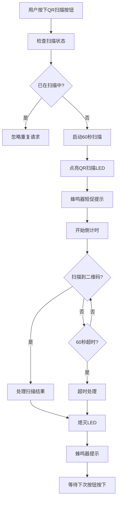

# 📱 QR扫描按钮接口定义

## 🎯 接口概述

为ROS机器人提供QR扫描按钮的接口定义，实现按需扫描功能，节省系统资源。

---

## 🔌 硬件接口定义

### 1. QR扫描按钮

```python
# 硬件接口定义 - 由硬件团队实现
class QRScanButton:
    """QR扫描按钮硬件接口"""
    
    def __init__(self):
        """初始化QR扫描按钮"""
        pass
    
    def is_pressed(self):
        """检查按钮是否被按下"""
        # 返回: True/False
        pass
    
    def register_callback(self, callback):
        """注册按钮按下回调函数"""
        # callback: 按钮按下时调用的函数
        pass
```

### 2. QR扫描LED指示灯

```python
# 硬件接口定义 - 由硬件团队实现
class QRScanLED:
    """QR扫描LED指示灯接口"""
    
    def __init__(self):
        """初始化LED"""
        pass
    
    def turn_on(self):
        """点亮LED"""
        pass
    
    def turn_off(self):
        """熄灭LED"""
        pass
    
    def blink(self, frequency=1.0):
        """LED闪烁"""
        # frequency: 闪烁频率(Hz)
        pass
```

### 3. 蜂鸣器接口

```python
# 硬件接口定义 - 由硬件团队实现
class Buzzer:
    """蜂鸣器接口"""
    
    def __init__(self):
        """初始化蜂鸣器"""
        pass
    
    def beep(self, duration=0.5):
        """单次蜂鸣"""
        # duration: 持续时间(秒)
        pass
    
    def beep_pattern(self, pattern):
        """蜂鸣模式"""
        # pattern: [0.5, 0.2, 0.5] 表示响0.5秒，停0.2秒，响0.5秒
        pass
```

---

## 📡 软件接口定义

### 1. 摄像头扫描器接口

```python
# 软件接口定义 - 已实现
class CameraScanner:
    """摄像头扫描器接口"""
    
    def start_button_scan(self):
        """开始按钮触发的扫描模式"""
        # 返回: True/False (是否成功启动)
        pass
    
    def stop_button_scan(self):
        """停止按钮扫描模式"""
        pass
    
    def is_button_scanning(self):
        """检查是否正在按钮扫描模式"""
        # 返回: True/False
        pass
    
    def get_remaining_scan_time(self):
        """获取剩余扫描时间"""
        # 返回: 剩余秒数 (整数)
        pass
    
    def register_callback(self, event, callback):
        """注册回调函数"""
        # event: 'qr_scanned' 或 'scan_timeout'
        # callback: 回调函数
        pass
```

### 2. 主控制器接口

```python
# 主控制器接口 - 需要实现
class RobotController:
    """机器人主控制器"""
    
    def __init__(self):
        # 初始化硬件接口
        self.qr_button = QRScanButton()
        self.qr_led = QRScanLED()
        self.buzzer = Buzzer()
        self.camera = CameraScanner()
        
        # 注册回调
        self.qr_button.register_callback(self.on_qr_button_pressed)
        self.camera.register_callback('qr_scanned', self.on_qr_scanned)
        self.camera.register_callback('scan_timeout', self.on_scan_timeout)
    
    def on_qr_button_pressed(self):
        """QR按钮按下回调 - 需要实现"""
        # 1. 检查是否已在扫描中
        # 2. 启动摄像头扫描
        # 3. 点亮LED
        # 4. 蜂鸣器提示
        pass
    
    def on_qr_scanned(self, qr_data):
        """QR扫描成功回调 - 需要实现"""
        # 1. 熄灭LED
        # 2. 蜂鸣器成功提示
        # 3. 处理扫描数据
        pass
    
    def on_scan_timeout(self, reason):
        """扫描超时回调 - 需要实现"""
        # 1. 熄灭LED
        # 2. 蜂鸣器超时提示
        # 3. 提示用户重试
        pass
```

---

## 🔄 工作流程

### 1. 按钮扫描流程



### 2. 状态定义

| 状态 | 描述 | LED状态 | 蜂鸣器 | 可执行操作 |
|------|------|---------|--------|------------|
| 空闲 | 等待按钮按下 | 熄灭 | 无 | 按下按钮 |
| 扫描中 | 60秒倒计时 | 亮起 | 短促音 | 等待完成 |
| 扫描成功 | 处理结果 | 熄灭 | 三声短音 | 继续工作 |
| 扫描超时 | 等待重试 | 熄灭 | 五声长音 | 重新按按钮 |

---

## 📋 实现要求

### 1. 硬件团队需要实现

- ✅ **QR扫描按钮**: 物理按钮及其GPIO控制
- ✅ **QR扫描LED**: 指示灯控制
- ✅ **蜂鸣器**: 声音提示控制
- ✅ **摄像头**: 图像采集和二维码识别

### 2. 软件团队需要实现

- ✅ **按钮回调**: 处理按钮按下事件
- ✅ **扫描控制**: 启动/停止扫描逻辑
- ✅ **状态管理**: 扫描状态跟踪
- ✅ **超时处理**: 60秒超时机制
- ✅ **用户反馈**: LED和蜂鸣器控制

### 3. 接口规范

```python
# 标准回调函数签名
def on_qr_button_pressed():
    """按钮按下回调 - 无参数"""
    pass

def on_qr_scanned(qr_data):
    """扫描成功回调 - qr_data: 扫描到的数据"""
    pass

def on_scan_timeout(reason):
    """扫描超时回调 - reason: 超时原因"""
    pass
```

---

## 🧪 测试接口

### 1. 硬件测试

```python
# 测试按钮功能
def test_qr_button():
    button = QRScanButton()
    button.register_callback(lambda: print("按钮被按下"))
    
    # 模拟按钮按下
    # 应该看到 "按钮被按下" 输出
```

### 2. 软件测试

```python
# 测试扫描功能
def test_qr_scan():
    camera = CameraScanner()
    
    # 测试启动扫描
    success = camera.start_button_scan()
    assert success == True
    
    # 测试状态检查
    scanning = camera.is_button_scanning()
    assert scanning == True
    
    # 测试剩余时间
    remaining = camera.get_remaining_scan_time()
    assert 0 <= remaining <= 60
```

---

## 📞 接口说明

### 1. 配置参数

```python
# 可配置的参数
SCAN_DURATION = 60  # 扫描持续时间(秒)
SCAN_INTERVAL = 0.1  # 扫描间隔(秒)
LED_BLINK_FREQ = 1.0  # LED闪烁频率(Hz)
BEEP_DURATION = 0.2  # 蜂鸣器持续时间(秒)
```

### 2. 错误处理

```python
# 错误情况处理
try:
    camera.start_button_scan()
except CameraNotAvailable:
    # 摄像头不可用
    pass
except AlreadyScanning:
    # 已在扫描中
    pass
except Exception as e:
    # 其他错误
    pass
```

---

## 📄 总结

这个接口定义提供了：

1. **清晰的硬件接口**: 按钮、LED、蜂鸣器的标准接口
2. **完整的软件接口**: 扫描控制、状态管理、回调处理
3. **详细的工作流程**: 从按钮按下到结果处理的完整流程
4. **测试规范**: 硬件和软件的测试方法
5. **错误处理**: 各种异常情况的处理方式

硬件团队可以根据这些接口定义来实现具体的硬件控制，软件团队可以基于这些接口来开发扫描逻辑。双方通过标准接口进行协作，互不干扰。

---

*接口定义版本: v1.0*
*最后更新: 2024年1月15日* 