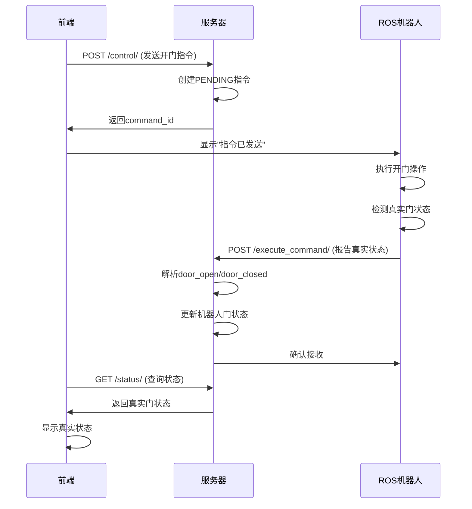

# 🚪 真实门状态API说明

## 🎯 功能概述

现在系统支持接收ROS端返回的真实门状态，不再使用假状态。当ROS机器人执行门控制指令后，会返回真实的门状态，系统会根据返回的状态更新数据库。

---

## 📡 API接口

### 指令执行结果报告

**接口地址**: `POST /api/robots/{robot_id}/execute_command/`

**功能**: ROS机器人报告指令执行结果，包括真实门状态

**请求参数**:
```json
{
    "command_id": 123,
    "result": "door_open"  // 真实门状态
}
```

**门状态格式**:
- `door_open` - 门已打开
- `door_closed` - 门已关闭
- `door_stuck` - 门卡住
- `door_error` - 门操作错误
- 其他格式 - 使用默认状态

---

## 🔄 工作流程

### 1. 标准门控制流程



### 2. 状态解析逻辑

```python
# 服务器端解析逻辑
if result and result.startswith('door_'):
    door_state = result.replace('door_', '').upper()
    if door_state in ['OPEN', 'CLOSED']:
        robot.set_door_status(door_state)  # 使用真实状态
        log_success(f"真实门状态: {door_state}")
    else:
        robot.set_door_status('OPEN')  # 使用默认状态
        log_warning(f"门状态解析失败: {result}")
else:
    robot.set_door_status('OPEN')  # 使用默认状态
    log_success("使用默认门状态")
```

---

## 📋 状态处理规则

### 1. 正常情况

| ROS返回 | 解析结果 | 数据库状态 | 日志级别 |
|---------|----------|------------|----------|
| `door_open` | OPEN | OPEN | SUCCESS |
| `door_closed` | CLOSED | CLOSED | SUCCESS |
| `door_stuck` | 无效 | OPEN | WARNING |
| `door_error` | 无效 | OPEN | WARNING |

### 2. 异常情况

| 情况 | 处理方式 | 数据库状态 | 日志级别 |
|------|----------|------------|----------|
| 无result参数 | 使用默认状态 | OPEN/CLOSED | SUCCESS |
| 格式错误 | 使用默认状态 | OPEN/CLOSED | WARNING |
| 网络超时 | 保持原状态 | 不变 | ERROR |

---

## 🧪 测试示例

### 1. 正常开门流程

```bash
# 1. 发送开门指令
curl -X POST http://localhost:8000/api/robots/1/control/ \
  -H "Authorization: Bearer $TOKEN" \
  -H "Content-Type: application/json" \
  -d '{"action": "open_door"}'

# 响应: {"command_id": 123, "status": "PENDING"}

# 2. ROS报告真实状态
curl -X POST http://localhost:8000/api/robots/1/execute_command/ \
  -H "Authorization: Bearer $TOKEN" \
  -H "Content-Type: application/json" \
  -d '{"command_id": 123, "result": "door_open"}'

# 响应: {"message": "指令执行成功", "status": "COMPLETED"}

# 3. 查询状态
curl -X GET http://localhost:8000/api/robots/1/status/ \
  -H "Authorization: Bearer $TOKEN"

# 响应: {"door_status": "OPEN", ...}
```

### 2. 门卡住情况

```bash
# ROS报告门卡住
curl -X POST http://localhost:8000/api/robots/1/execute_command/ \
  -H "Authorization: Bearer $TOKEN" \
  -H "Content-Type: application/json" \
  -d '{"command_id": 124, "result": "door_stuck"}'

# 系统会记录警告日志，但使用默认状态
```

### 3. Python测试脚本

```python
import requests

def test_real_door_status():
    # 登录获取token
    token = get_token()
    
    # 发送开门指令
    command = send_door_command("open_door", token)
    command_id = command["command_id"]
    
    # 模拟ROS返回真实状态
    result = report_command_result(command_id, "door_open", token)
    print(f"执行结果: {result['message']}")
    
    # 查询真实状态
    status = get_robot_status(token)
    print(f"真实门状态: {status['door_status']}")

# 运行测试
test_real_door_status()
```

---

## 📊 日志记录

### 1. 成功日志

```json
{
    "level": "SUCCESS",
    "message": "机器人 Robot-001 执行开门指令成功，真实门状态: OPEN",
    "log_type": "ROBOT_CONTROL",
    "data": {
        "real_door_state": "OPEN",
        "result": "door_open"
    }
}
```

### 2. 警告日志

```json
{
    "level": "WARNING",
    "message": "机器人 Robot-001 执行开门指令，但门状态解析失败: door_stuck",
    "log_type": "ROBOT_CONTROL",
    "data": {
        "result": "door_stuck"
    }
}
```

---

## 🔧 配置说明

### 1. 门状态映射

```python
# 在 views.py 中配置
DOOR_STATE_MAPPING = {
    'door_open': 'OPEN',
    'door_closed': 'CLOSED',
    'door_stuck': 'OPEN',  # 卡住时默认开门
    'door_error': 'OPEN',  # 错误时默认开门
}
```

### 2. 默认状态

```python
# 开门指令默认状态
OPEN_DOOR_DEFAULT = 'OPEN'

# 关门指令默认状态
CLOSE_DOOR_DEFAULT = 'CLOSED'
```

---

## ⚠️ 注意事项

### 1. ROS端要求

- ROS端必须返回 `door_` 前缀的状态
- 状态值应该是小写
- 超时时间建议5秒

### 2. 服务器端处理

- 自动解析 `door_` 前缀
- 转换为大写状态值
- 验证状态有效性
- 记录详细日志

### 3. 前端显示

- 显示真实门状态
- 处理异常状态
- 提供状态说明

---

## 📞 技术支持

如有问题，请联系开发团队或查看系统日志。

---

*API版本: v1.0*
*最后更新: 2024年1月15日* 