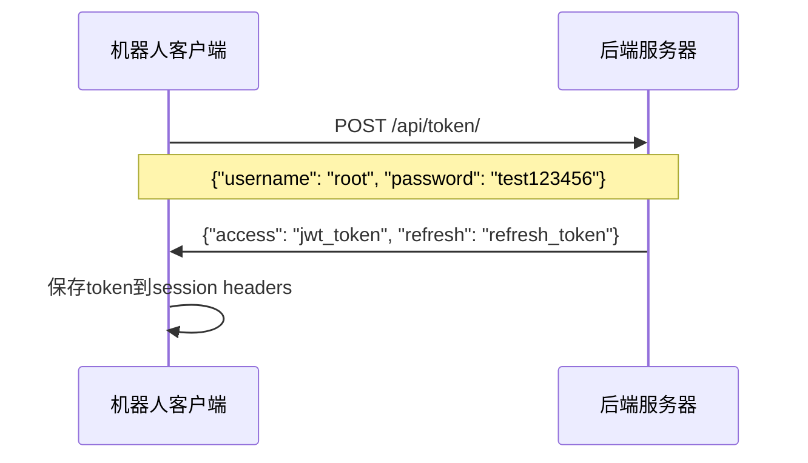
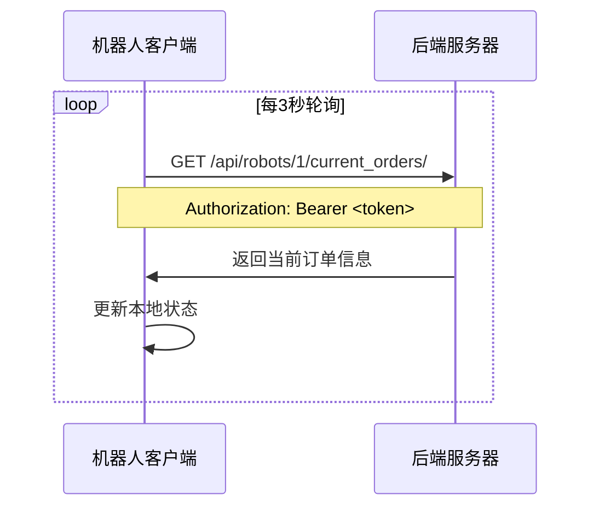
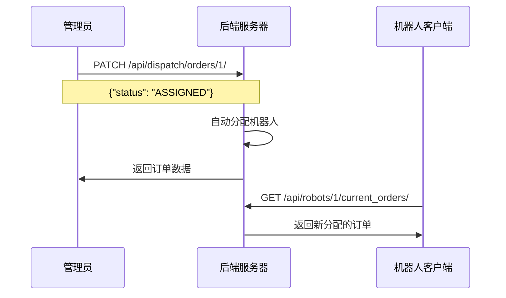
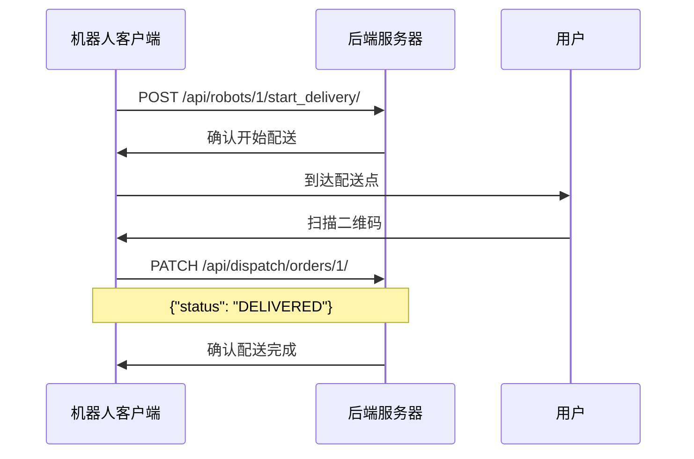

# 机器人客户端与后端服务器通信架构

## 通信架构概览

```
┌─────────────────────────────────────────────────────────────────┐
│                        机器人客户端 (Robot Client)                │
├─────────────────────────────────────────────────────────────────┤
│  ┌─────────────┐  ┌─────────────┐  ┌─────────────┐            │
│  │   GUI界面    │  │  硬件控制    │  │  网络通信    │            │
│  │ (Pygame/    │  │ (GPIO/      │  │ (HTTP API   │            │
│  │  Tkinter)   │  │  Camera)    │  │  Client)    │            │
│  └─────────────┘  └─────────────┘  └─────────────┘            │
└─────────────────────────────────────────────────────────────────┘
                                │
                                │ HTTP/HTTPS
                                │ JWT Authentication
                                ▼
┌─────────────────────────────────────────────────────────────────┐
│                      Django后端服务器                            │
├─────────────────────────────────────────────────────────────────┤
│  ┌─────────────┐  ┌─────────────┐  ┌─────────────┐            │
│  │  API视图     │  │  数据模型    │  │  认证授权    │            │
│  │ (ViewSets)  │  │ (Models)    │  │ (JWT)       │            │
│  └─────────────┘  └─────────────┘  └─────────────┘            │
└─────────────────────────────────────────────────────────────────┘
                                │
                                │ MySQL
                                ▼
┌─────────────────────────────────────────────────────────────────┐
│                          数据库                                   │
│                    (MySQL Database)                             │
└─────────────────────────────────────────────────────────────────┘
```

## 核心通信组件

### 1. 机器人客户端 (robot_client/)

#### 1.1 网络通信模块 (`network/api_client.py`)

**主要功能**:
- JWT Token认证管理
- HTTP API请求封装
- 错误处理和重试机制
- 会话管理

**关键方法**:
```python
class APIClient:
    def __init__(self, logger):
        # 初始化HTTP会话
        self.session = requests.Session()
        # 获取JWT token
        self.access_token = self._get_auth_token()
    
    def _get_auth_token(self):
        """获取JWT认证token"""
        # 使用root用户认证
        auth_data = {'username': 'root', 'password': 'test123456'}
        response = requests.post(f"{self.server_url}/api/token/", json=auth_data)
        return response.json()['access']
    
    def get_current_orders(self):
        """获取机器人当前订单"""
        url = f"{self.server_url}/api/robots/{self.robot_id}/current_orders/"
        return self.session.get(url)
    
    def receive_orders(self):
        """接收订单分配"""
        url = f"{self.server_url}/api/robots/{self.robot_id}/receive_orders/"
        return self.session.post(url, json={'action': 'receive'})
    
    def start_delivery(self):
        """开始配送"""
        url = f"{self.server_url}/api/robots/{self.robot_id}/start_delivery/"
        return self.session.post(url, json={'action': 'close_door_and_start'})
    
    def update_order_status(self, order_id, new_status):
        """更新订单状态"""
        url = f"{self.server_url}/api/dispatch/orders/{order_id}/"
        return self.session.patch(url, json={'status': new_status})
```

#### 1.2 配置管理 (`config.py`)

**配置项**:
```python
class Config:
    # 服务器配置
    SERVER_URL = 'http://localhost:8000'
    ROBOT_ID = 1
    ROBOT_NAME = 'Robot-001'
    
    # 轮询配置
    POLL_INTERVAL = 3  # 秒
    
    # API端点
    API_ENDPOINTS = {
        'current_orders': lambda robot_id: f'/api/robots/{robot_id}/current_orders/',
        'receive_orders': lambda robot_id: f'/api/robots/{robot_id}/receive_orders/',
        'start_delivery': lambda robot_id: f'/api/robots/{robot_id}/start_delivery/',
        'update_order': lambda order_id: f'/api/dispatch/orders/{order_id}/',
    }
```

#### 1.3 日志系统 (`utils/logger.py`)

**功能**:
- 文件和控制台日志输出
- 不同级别的日志记录
- 自动创建日志目录

### 2. 后端服务器 (campus_delivery/)

#### 2.1 API视图 (`core/views.py`)

**RobotViewSet - 机器人管理API**:

```python
class RobotViewSet(viewsets.ModelViewSet):
    queryset = Robot.objects.all()
    serializer_class = RobotSerializer
    
    @action(detail=True, methods=['get'])
    def current_orders(self, request, pk=None):
        """获取机器人当前订单的完整信息"""
        robot = self.get_object()
        orders = robot.get_current_orders()
        
        # 构建详细的订单信息
        orders_data = []
        for order in orders:
            order_data = {
                "order_id": order.id,
                "status": order.status,
                "student": {...},
                "delivery_location": {...},
                "qr_code_data": {...}
            }
            orders_data.append(order_data)
        
        return Response({
            "robot_id": robot.id,
            "robot_name": robot.name,
            "status": robot.status,
            "current_orders": orders_data,
            "delivery_route": [...],
            "summary": {...}
        })
    
    @action(detail=True, methods=['post'])
    def receive_orders(self, request, pk=None):
        """接收订单分配给机器人"""
        robot = self.get_object()
        order_ids = request.data.get('order_ids', [])
        
        # 更新订单状态和机器人关联
        orders.update(status='ASSIGNED', robot=robot)
        robot.status = 'LOADING'
        robot.save()
        
        # 返回完整的订单信息
        return Response({
            "detail": f"成功分配 {orders.count()} 个订单给机器人 {robot.name}",
            "robot_id": robot.id,
            "status": robot.status,
            "current_orders": orders_data
        })
    
    @action(detail=True, methods=['post'])
    def start_delivery(self, request, pk=None):
        """机器人开始配送"""
        robot = self.get_object()
        
        # 检查是否有待配送的订单
        current_orders = robot.get_current_orders()
        if not current_orders.exists():
            return Response({"detail": "没有待配送的订单"}, status=400)
        
        # 更新机器人状态
        robot.status = 'DELIVERING'
        robot.save()
        
        return Response({
            "detail": "机器人已开始配送",
            "robot_id": robot.id,
            "status": robot.status
        })
```

**DispatchOrderViewSet - 订单分发API**:

```python
class DispatchOrderViewSet(viewsets.ModelViewSet):
    serializer_class = DeliveryOrderSerializer
    permission_classes = [IsDispatcher]
    
    def partial_update(self, request, *args, **kwargs):
        """更新订单状态"""
        instance = self.get_object()
        new_status = request.data.get('status')
        
        # 状态验证
        if new_status not in ['PENDING', 'ASSIGNED', 'DELIVERING', 'DELIVERED']:
            return Response({"detail": "不允许设置该状态"}, status=400)
        
        # 自动分配机器人
        if new_status == 'ASSIGNED' and not instance.robot:
            robot = Robot.objects.filter(status='IDLE').first()
            if robot:
                instance.robot = robot
                robot.status = 'LOADING'
                robot.save()
        
        instance.status = new_status
        instance.save()
        
        # 返回完整订单数据
        if new_status in ['ASSIGNED', 'DELIVERING']:
            order_data = {...}  # 完整的订单信息
            return Response({
                "detail": f"订单 {instance.id} 状态已更新为 {new_status}",
                "order_data": order_data,
                "robot_id": instance.robot.id if instance.robot else None
            })
        
        return Response(self.get_serializer(instance).data)
```

#### 2.2 URL路由配置 (`core/urls.py`)

```python
router = DefaultRouter()
router.register('robots', RobotViewSet, basename='robots')
router.register(r'dispatch/orders', DispatchOrderViewSet, basename='dispatch-orders')

urlpatterns = [
    path('api/', include(router.urls)),
    path('api/token/', TokenObtainPairView.as_view(), name='token_obtain_pair'),
    path('api/token/refresh/', TokenRefreshView.as_view(), name='token_refresh'),
    path('api/verify_qr/', QRCodeVerifyView.as_view(), name='verify-qr'),
]
```

## 通信流程详解

### 1. 认证流程



### 2. 订单轮询流程



### 3. 订单分配流程



### 4. 配送流程



## API端点详细说明

### 机器人相关API

| 端点 | 方法 | 功能 | 请求参数 | 响应 |
|------|------|------|----------|------|
| `/api/robots/{id}/current_orders/` | GET | 获取机器人当前订单 | 无 | 订单列表 |
| `/api/robots/{id}/receive_orders/` | POST | 接收订单分配 | `{"order_ids": [1,2]}` | 分配结果 |
| `/api/robots/{id}/start_delivery/` | POST | 开始配送 | `{"action": "close_door_and_start"}` | 配送状态 |

### 订单相关API

| 端点 | 方法 | 功能 | 请求参数 | 响应 |
|------|------|------|----------|------|
| `/api/dispatch/orders/{id}/` | PATCH | 更新订单状态 | `{"status": "ASSIGNED"}` | 订单数据 |
| `/api/orders/{id}/qr_code/` | GET | 获取订单二维码 | 无 | 二维码数据 |

### 认证API

| 端点 | 方法 | 功能 | 请求参数 | 响应 |
|------|------|------|----------|------|
| `/api/token/` | POST | 获取JWT token | `{"username": "root", "password": "test123456"}` | Token信息 |
| `/api/token/refresh/` | POST | 刷新token | `{"refresh": "refresh_token"}` | 新token |

## 数据格式

### 订单数据结构

```json
{
    "order_id": 1,
    "status": "ASSIGNED",
    "student": {
        "id": 2,
        "name": "5566",
        "email": "student@example.com"
    },
    "delivery_location": {
        "building": "Admin Office",
        "room": "101"
    },
    "qr_code_data": {
        "payload": "base64_encoded_data",
        "signature": "abc123def456ghi789",
        "qr_image_url": "http://localhost:8000/qr/1/"
    }
}
```

### 机器人状态数据结构

```json
{
    "robot_id": 1,
    "robot_name": "Robot-001",
    "status": "LOADING",
    "current_orders": [...],
    "delivery_route": [...],
    "summary": {
        "total_orders": 2,
        "loaded_orders": 1,
        "total_distance": "2.5km",
        "estimated_total_time": "30分钟"
    }
}
```

## 错误处理

### HTTP状态码

- `200 OK`: 请求成功
- `201 Created`: 资源创建成功
- `400 Bad Request`: 请求参数错误
- `401 Unauthorized`: 认证失败
- `403 Forbidden`: 权限不足
- `404 Not Found`: 资源不存在
- `500 Internal Server Error`: 服务器内部错误

### 错误响应格式

```json
{
    "detail": "错误描述信息",
    "error_code": "ERROR_CODE",
    "timestamp": "2025-07-30T14:30:00Z"
}
```

## 安全机制

### 1. JWT认证
- 使用JWT token进行身份验证
- Token自动刷新机制
- 安全的token存储

### 2. 权限控制
- 基于角色的权限控制
- 管理员、分发员、普通用户权限分离
- API端点级别的权限验证

### 3. 数据验证
- 请求参数验证
- 状态转换验证
- 数据完整性检查

## 性能优化

### 1. 连接池
- 使用requests.Session()保持连接
- 减少连接建立开销

### 2. 轮询优化
- 可配置的轮询间隔
- 智能轮询（有数据时增加频率）

### 3. 缓存机制
- 本地状态缓存
- 减少重复请求

## 监控和日志

### 1. 客户端日志
- 详细的API调用日志
- 错误和异常记录
- 性能指标记录

### 2. 服务器日志
- API访问日志
- 错误日志
- 性能监控

### 3. 健康检查
- 定期连接测试
- 服务可用性监控
- 自动重连机制

---

**文档版本**: v1.0  
**更新时间**: 2025-07-30  
**维护者**: 机器人配送系统开发团队 